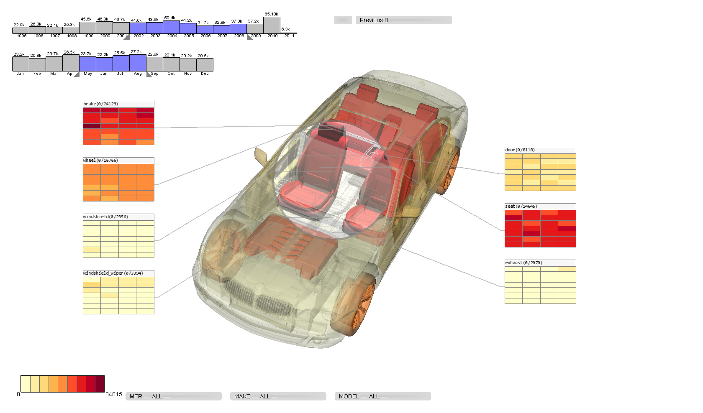

## VehicleVis
This is the code base of my Master's Thesis Project

### Abstract
Many text documents contain real-world dimensions such as words describing physical objects and spatial relations. 
However, text visualizations are often abstract in nature and present visuals that are out of context with 
real-life expectations. We explore a visualization approach which reconstructs the subject matter from 
physical entities within the text document to match their real-world counterparts. Furthermore, additional 
attributes (such as frequency) relating to each physical entity are used as rendering parameters to create 
an information-rich visual, where important items are emphasized with graphical effects to attract the 
attention of viewers.

In this project, we look at the visual analysis hundreds of thousands of vehicle complaint reports. A directly
application of this prototype is to use it to determine the overall safety and reliability of different types of vehicles.

